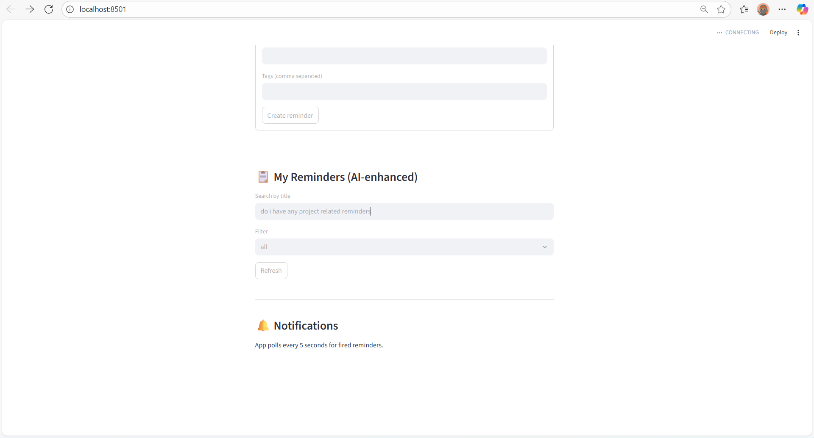
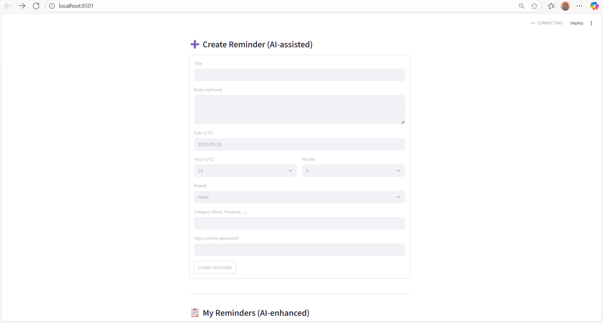
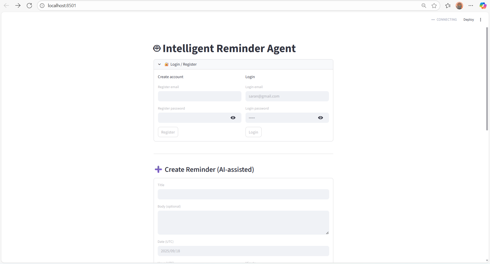

## 🛠️ Tech Stack
- **Backend**: FastAPI, SQLite (or any DB), Redis (for scheduling/notifications), SMTP (for emails)
- **Frontend**: Streamlit
- **Auth**: JWT Tokens
- **AI**: Simple NLP rules + Gemini API integration


<div align="center">
  
  
  
</div>
---

## 📦 Installation Guide

Follow these steps carefully to set up both backend and frontend.

---

### 1. Clone the repository
```bash
git clone https://github.com/yourusername/reminder-agent.git
cd reminder-agent

cd backend
python -m venv venv
# Activate the environment
# On Linux/Mac:
source venv/bin/activate
# On Windows:
venv\Scripts\activate
pip install -r requirements.txt 
```
Create a new file called .env inside the backend folder and create a file named secrets.toml in frontend/.streamlit/ and the following contents:
```bash
SECRET_KEY=super-secret-change-this
SMTP_HOST=smtp.gmail.com
SMTP_PORT=587
SMTP_USER=your-email@example.com
SMTP_PASSWORD=your-smtp-password
REDIS_URL=redis://localhost:6379
GEMINI_API_KEY=your-gemini-api-key
BASE_URL=http://127.0.0.1:8000

```
### Run the Application
Start Backend
```bash 
cd backend
uvicorn main:app --reload --port 8000
```

Backend runs on: http://127.0.0.1:8000

4.2 Start Frontend
```bash
cd frontend
streamlit run streamlit_app.py
```

Frontend runs on: http://localhost:8501
